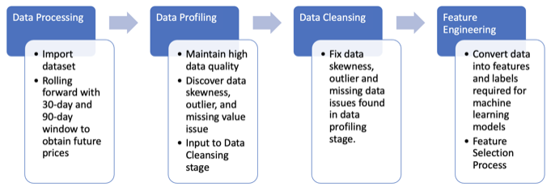
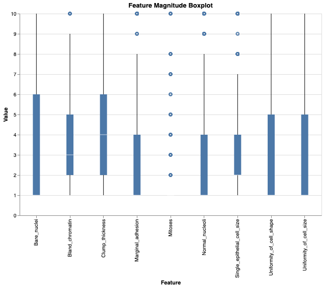
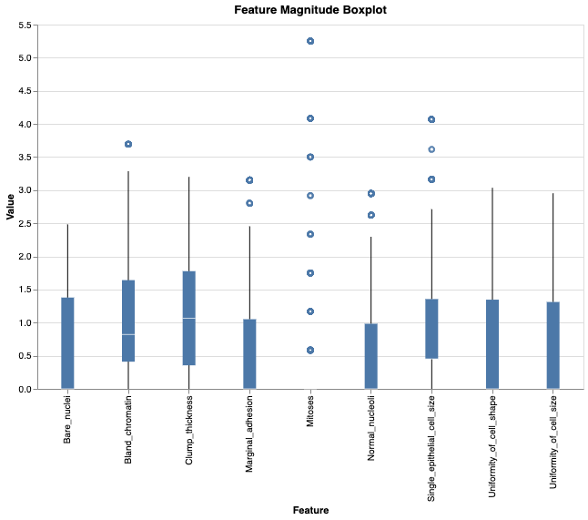
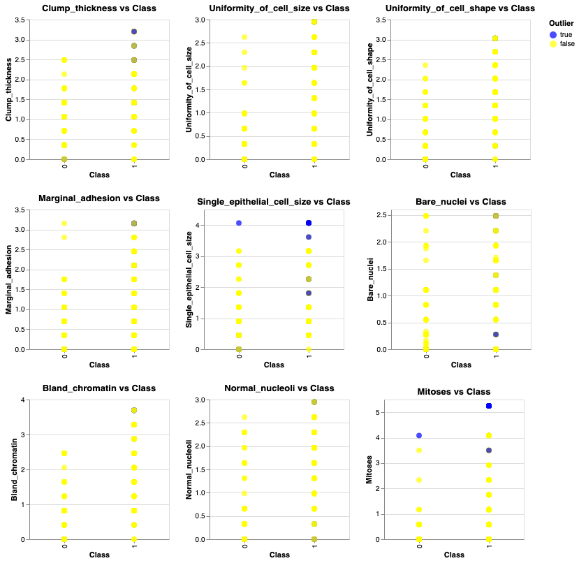
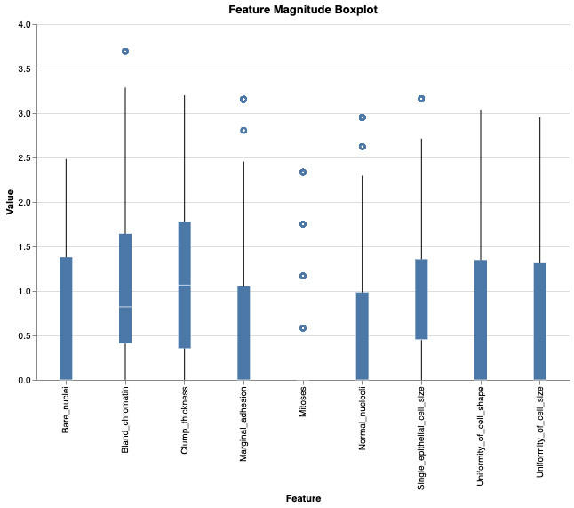
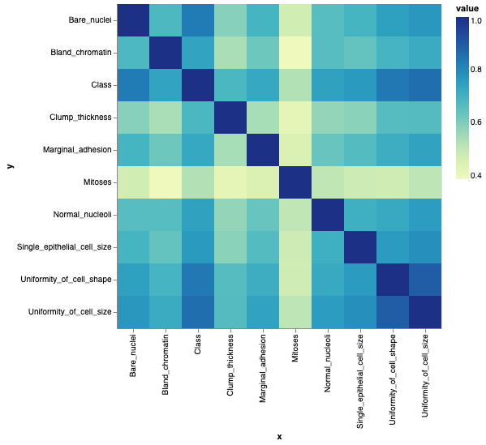
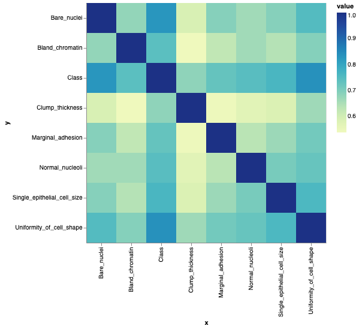
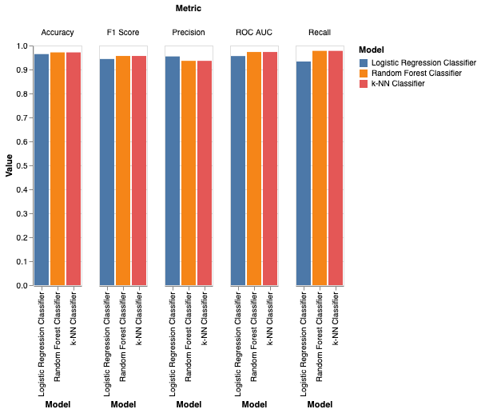
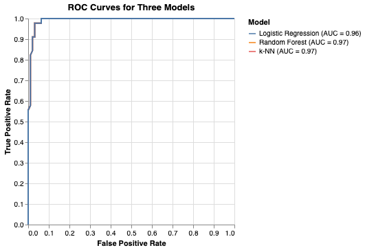

# Data Analysis of Breast Cancer Wisconsin Original Dataset

## Introduction

American Cancer Society estimated that in 2024 there will be 310,720 new cases of invasive breast cancer in women and 2,790 in men. Also, they expect that about 56,500 women will be diagnosed with Ductal Carcinoma in Situ (American Cancer Society, 2024).

For about the last fifteen years, the incidence of breast cancer has been increasing by approximately 0.6% per year, with even faster growing rates among younger women. Nonetheless, although there has been a decline of 42% in the rates for women from 1989 to date due to early detection, better knowledge on the disease and improved treatment approaches, yet black women still die at a rate 40% higher than their white counterparts.

For one, advancing age is a risk factor for breast cancer. Obese people are at higher risks of developing the disease. In addition, hormone replacement therapy on menopause increases the possibilities of having cancer. Likewise, excessive consumption of alcohol leads to breast cancer. Finally, not being active physically could result in this deadly condition. And mammography tests help identify early stages of breast cancer thereby reducing chances of mortality.

Treatment options encompass local therapy (surgery and radiation), hormonal treatments such as tamoxifen, or chemotherapy depending on the nature of the breast cancer. The five-year survival rate for invasive breast carcinoma is 91%, but this rate drops for African Americans compared to Caucasians.

Breast Cancer Wisconsin dataset published will be analyzed and provide a better understanding of these disparities, which when combined with effective prevention strategies and cures can help save lives (Wolberg, 1992). The reasons for higher death rates in some communities, effectiveness of present treatment methods and ways through which the different risk factors influence occurrence rate should be known from such type of analysis. This data retrieval may potentially boost strategies on how to detect most types of cancers early, customize therapies according to patients’ needs as well as save more lives at last.

## Data Source

The Wisconsin Breast Cancer dataset is an important resource that results from digitalized images of fine-needle aspirates (FNA) of breast masses. This dataset containing cases of breast cancer. taken from the Wisconsin Hospitals, Madison by Wolberg (2018), and show clearly and in detail the cell nuclei within the breast mass.

```python
from ucimlrepo import fetch_ucirepo 
import pandas as pd

def load_dataset() -> pd.DataFrame:  
  # fetch dataset 
  breast_cancer_wisconsin_original = fetch_ucirepo(id=15) 
  df = breast_cancer_wisconsin_original.data.features.join(breast_cancer_wisconsin_original.data.targets )
  return df

df = load_dataset()
display(df.head())
```


<div>

<table border="1" class="dataframe">
  <thead>
    <tr style="text-align: right;">
      <th></th>
      <th>Clump_thickness</th>
      <th>Uniformity_of_cell_size</th>
      <th>Uniformity_of_cell_shape</th>
      <th>Marginal_adhesion</th>
      <th>Single_epithelial_cell_size</th>
      <th>Bare_nuclei</th>
      <th>Bland_chromatin</th>
      <th>Normal_nucleoli</th>
      <th>Mitoses</th>
      <th>Class</th>
    </tr>
  </thead>
  <tbody>
    <tr>
      <th>0</th>
      <td>5</td>
      <td>1</td>
      <td>1</td>
      <td>1</td>
      <td>2</td>
      <td>1.0</td>
      <td>3</td>
      <td>1</td>
      <td>1</td>
      <td>2</td>
    </tr>
    <tr>
      <th>1</th>
      <td>5</td>
      <td>4</td>
      <td>4</td>
      <td>5</td>
      <td>7</td>
      <td>10.0</td>
      <td>3</td>
      <td>2</td>
      <td>1</td>
      <td>2</td>
    </tr>
    <tr>
      <th>2</th>
      <td>3</td>
      <td>1</td>
      <td>1</td>
      <td>1</td>
      <td>2</td>
      <td>2.0</td>
      <td>3</td>
      <td>1</td>
      <td>1</td>
      <td>2</td>
    </tr>
    <tr>
      <th>3</th>
      <td>6</td>
      <td>8</td>
      <td>8</td>
      <td>1</td>
      <td>3</td>
      <td>4.0</td>
      <td>3</td>
      <td>7</td>
      <td>1</td>
      <td>2</td>
    </tr>
    <tr>
      <th>4</th>
      <td>4</td>
      <td>1</td>
      <td>1</td>
      <td>3</td>
      <td>2</td>
      <td>1.0</td>
      <td>3</td>
      <td>1</td>
      <td>1</td>
      <td>2</td>
    </tr>
  </tbody>
</table>
</div>


### Data Collection

Data collection was done through a classification approach known as Mult-surface Method-Tree (MSM-T), which uses linear programming to construct decision trees (Bennett, 1992). MSM-T technique selected the most relevant features among all possible combinations of one to four features and between one and three separating planes.

### Data Processing

The linear program for generating a separating plane in a 3-dimensional space. What makes this dataset so valuable is its robustness and completeness with respect to feature selection as well as classification approaches used here.

### Expected Data Schema

```python
display(df.info())
```

    <class 'pandas.core.frame.DataFrame'>
    RangeIndex: 699 entries, 0 to 698
    Data columns (total 10 columns):
     #   Column                       Non-Null Count  Dtype  
    ---  ------                       --------------  -----  
     0   Clump_thickness              699 non-null    int64  
     1   Uniformity_of_cell_size      699 non-null    int64  
     2   Uniformity_of_cell_shape     699 non-null    int64  
     3   Marginal_adhesion            699 non-null    int64  
     4   Single_epithelial_cell_size  699 non-null    int64  
     5   Bare_nuclei                  683 non-null    float64
     6   Bland_chromatin              699 non-null    int64  
     7   Normal_nucleoli              699 non-null    int64  
     8   Mitoses                      699 non-null    int64  
     9   Class                        699 non-null    int64  
    dtypes: float64(1), int64(9)
    memory usage: 54.7 KB


    None


The Breast Cancer Wisconsin dataset is expected to have a simple schema including 11
attributes as below:

- **Sample code number**: The sample code number is a unique identifier that distinguishes
one sample from another. This attribute is not meaningful to our data analysis so was
excluded in data frame.
- **Clump thickness**: This feature measures how thick the clump of cells is. It can range in
value from 1 to 10, with 1 being the smallest and 10 being the largest. The thickness of
this clump can be suggestive about the seriousness of the cancer.
- **Uniformity** of cell size: This attribute aims at assessing uniformity among cancer cell
sizes. A range of values between 1 and 10 indicates low or high uniformity respectively.
High uniformity could indicate more aggressive cancer.
- **Uniformity** of cell shape: This attribute aims at assessing uniformity among cancer cell
shapes. A range of values between 1 and 10 indicates low or high uniformity
respectively. High uniformity could indicate more aggressive cancer.
- **Marginal adhesion**: The attribute measures how much attraction cancer cells have for
one another and their own tissue i.e stromal invasion capacity, it ranges from one to
ten; where low adhesion is indicated by “one” while high adhesion is represented by
“ten”, a highly invasive malignancy may result in high neoplastic adhesion.
- **Single epithelial cell size**: This feature determines the size of individual epithelial cells
on a scale from one to ten where the lowest value signifies smallest (smallest epithelial
cell) while highest value represents largest (largest epithelial cell). Larger cells could
suggest more aggressive cancers.
- **Bare nuclei**: Number of nucleuses less cells vary from one to ten representing lows to
highs as well respectively, such as having many bare nuclei would mean existence of
highly malignant tumour.
- **Bland chromatin**: This refers to genetic content texture in nuclear area, ranging
between smoothness which is given when it’s scored “1” up to roughness/ blandness
when scored “10”. For example, cancerous cells with ‘bland’ chromatin may be more
aggressive.
- **Normal nucleoli**: Number of normal (non-cancerous) nucleoli in a cell is rated on a scale
of one to ten, where low values mean few while high values imply many. A small
number of normal nucleoli may suggest more highly malignant tumour.
- **Mitoses**: Mitotic activity refers to the number of cells currently undergoing cell division
and it is scored from 1 to 10; at its minimum score it means that no considerable mitotic
activity is present while at maximum score there are many mitoses [24]. The higher the
value of mitosis is, the greater likelihood for cancer to cause aggressiveness.
- **Class**: This variable determines if a given sample will be benign or malignant based on
features other than itself.

## Data Pipeline

The data pipeline consists of four distinct stages - Data Processing, Data Profiling, Data Cleansing and Feature Engineering.



In data processing stage, raw datasets are collected and transformed into a consistent format that can be used for further analysis. The second stage is data profiling which involves exploring the dataset to identify any issues or patterns in the values present within it. Following this is a third step – data cleansing - where any identified issues are addressed through techniques such as imputation or outlier removal to ensure high-quality results from downstream analyses. Finally, feature engineering combines existing features together with new ones created by transforming existing variables to create more powerful representations for machine learning model.

Based on the information from the UCI Machine Learning Repository, the Breast Cancer Wisconsin dataset is already in a consistent format that can be used for further analysis (Wolberg, 1992). However, it does have some missing values. Therefore, a data processing stage might not necessary. What makes this dataset so valuable is its robustness and completeness with respect to feature selection as well as classification approaches used here.

### Data Profiling

Data profiling is a technique used to observe the data distribution of each feature. It provides an overview of the data by providing information about min/max values, mean, null or infinite values, and count. This helps us to identify any outliers in our dataset which can then be removed through data cleansing techniques. Data profiling serves as an important starting
point for further analysis and understanding what type of cleaning might be required for our dataset before we move on with other tasks like machine learning models building.

Exploratory Data Analysis (EDA) is a ground-breaking book in the field of data analysis. It introduces and explains the principles of exploratory data analysis, which involves analyzing datasets to summarize their main characteristics using statistical graphics and other visualization methods (Turkey, 1997).

EDA framework helps describe a set of data features, expose its inner structure, get out important variables, identify any anomalies and outliers and test for the underlying assumptions. Here are some problems that may be discovered in an EDA report:

- **Missing Values** - By using EDA it is possible to find columns with missing values. In this regard, you will probably replace or rather remove them depending on what proportion of values were not found.
- **Outliers** - In case there are outliers in your data, performing EDA can help you to detec  them. Such cases differ greatly from other observations. These strange values might be true or erroneous.
- **Distribution of Data** - When one does exploratory analysis of data, he/she can understand its distribution too well. If it’s skewed, then it might not work as expected by some machine learning algorithms.
- **Correlation** - Furthermore, through conducting EDA on your dataset you can also determine if there are any correlated features among them which will lead multicollinearity among linear regression models if they have highly correlated features.
- **Constant Features** - Moreover, one may equally use this step to determine if there are any constant features in dataset that lacks useful information hence, they need to be deleted as well.
- **Categorical Variables** - Additionally, when engaged in exploratory analysis of data one may also find out how many categorical variables exist and their distinct categories too since a few categories might have minimal counts thus requiring special treatment separately.
- **Feature Magnitude** - Furthermore another thing that comes into the picture during EDA is whether the different measures are being used for scaling features for such algorithms like learning machines where scale needs to be uniform across all these
arrays.

### Data Cleansing

Data Cleansing stage handles missing values, outliers, feature engineering, etc. This could involve techniques such as imputation or removal of instances with missing values, depending on the proportion of missing data and the specific requirements of your analysis or model.

A strategic change is being introduced in our data processing pipeline to ensure efficiency and coherence. We will merge Exploratory Data Analysis (EDA) with the data cleaning step. As a result, we can now spot missing values, outliers or other red flags easily during clean-up. This way, EDA helps us to ensure that our data is not only clean but also understood as well leading to more precise and dependable subsequent analysis and models. In this way, one can be sure that all the relevant information regarding the used dataset has been found before any decision on further steps for pre-processing is made.


#### Constant Features

In Exploratory Data Analysis (EDA) the first step is to identify features that are constant in order to remove them as they do not contribute any information and cannot be used in predictive modeling. The “constant feature” is defined as a characteristic having the same value for every record in the dataset.

```python
# Find constant features
def detect_constant_features(df: pd.DataFrame) -> list:
    return [col for col in df.columns if df[col].nunique() == 1]
  
constant_features = detect_constant_features(df)

# Print constant features
print('Constant features:', constant_features)

```

    Constant features: []


There is no constant features issue in the dataset.

#### Categorical Variables

It is important to identify and analyze categorical variables as they can greatly impact one’s analysis and predictive models. Some categorical variables may need special treatment like encoding, grouping or even excluding them altogether from the analysis if they contain too many categories (high cardinality) or very few observations (low frequency).

The Breast Cancer Wisconsin Original dataset primarily consists of integer features, with the target variable being categorical (2 for benign, 4 for malignant). However, the categorical target variable should be properly encoded (e.g., 0 for benign and 1 for malignant) for later data analyisis models.


```python
df['Class'] = df['Class'].map({2: 0, 4: 1})
```

#### Missing Values

By using EDA it is possible to find columns with missing values. In this regard, you will probably replace or rather remove them depending on what proportion of values were not found.

In the dataset, there are 16 missing values are identified in attribute “Bare nuclei” with 2.3% missing ratio.

Clinical datasets often have high missingness which may jeopardize modeling if not well managed. There is a chance of overcoming these problems by imputing the variable values, which have disappeared for any reasons. Traditional imputation techniques tend to rely heavily on simple statistical analysis, such as mean imputation and complete case scenarios which are typified by numerous limitations that eventually degrade learning performance.

It is better to use imputation methods instead of discarding these rows. Such a step will hold on to important data and enhance the learning algorithms’ accuracy. The most common ones include k nearest neighbours (k-NN), random forests (RF) and support vector machines (SVM) since they have high robustness and performance with missing data (Wu, Khorshidi, Aickelin,
Edib, & Peate, 2020).

k-NN imputation method was used to fill the missing value of attribute “Bare Nuclei”. One such case study was carried out on the Breast Cancer Wisconsin dataset by Huang and Cheng (2020) to show the efficiency of k-NN imputation. The study revealed that models trained with k-NN imputed data had high sensitivity (0.8810) and specificity (0.9859), meaning the imputation method did not undermine the model’s capacity to correctly identify positive and negative cases. Furthermore, this balanced accuracy (0.9334) confirms that k-NN imputation can be safely relied upon with respect to this dataset.

```python
import pandas as pd

# Find missing values
def missing_values(df: pd.DataFrame) -> pd.Series:
    return df.isnull().sum()
  
missing_values = missing_values(df)
print("Missing values in each column:\n", missing_values)
```

    Missing values in each column:
     Clump_thickness                 0
    Uniformity_of_cell_size         0
    Uniformity_of_cell_shape        0
    Marginal_adhesion               0
    Single_epithelial_cell_size     0
    Bare_nuclei                    16
    Bland_chromatin                 0
    Normal_nucleoli                 0
    Mitoses                         0
    Class                           0
    dtype: int64


```python
from sklearn.impute import KNNImputer

def fix_missing_values_using_knn(df: pd.DataFrame, neighbors: int) -> pd.DataFrame:
    # Using k-NN Imputation to fix missing value
    imputer = KNNImputer(n_neighbors=neighbors, weights='uniform', metric='nan_euclidean')

    # Perform imputation
    df_imputed = imputer.fit_transform(df)
    df = pd.DataFrame(df_imputed, columns=df.columns)
    return df
  

df = fix_missing_values_using_knn(df, neighbors=5)

# Find missing values
missing_values = df.isnull().sum()
print("Missing values in each column:\n", missing_values)
```

    Missing values in each column:
     Clump_thickness                0
    Uniformity_of_cell_size        0
    Uniformity_of_cell_shape       0
    Marginal_adhesion              0
    Single_epithelial_cell_size    0
    Bare_nuclei                    0
    Bland_chromatin                0
    Normal_nucleoli                0
    Mitoses                        0
    Class                          0
    dtype: int64


####	Feature Magnitude

Feature magnitude issues can happen when some features in a dataset have different scales. This may impact the efficiency of data analysis algorithms that are scale sensitive. 

To begin with, one can define a boxplot as a graphical representation of statistical data used to detect outliers. Outliers are usually values that fall below Q1 - 1.5IQR or above Q3 + 1.5IQR where the first and third quartiles are Q1 and Q3 respectively, and IQR is the Interquartile Range (Q3 - Q1).

A box plot is made up of a box (that’s why it’s called a box plot) which represents the IQR, a line that shows the median value within the box, and two whiskers extending from the box to represent the range of values covered by 1.5*IQR for data. Those lying beyond the whiskers are outliers.

```python
import altair as alt

def show_boxplot(df: pd.DataFrame) -> alt.Chart:
    # Boxplot for visualizing feature magnitudes
    boxplot = alt.Chart(df).transform_fold(
        df.columns.tolist(),
        as_=['Feature', 'Value']
    ).mark_boxplot().encode(
        x='Feature:N',
        y='Value:Q'
    ).properties(
        width=600,
        height=400,
        title='Feature Magnitude Boxplot'
    )
    return boxplot

show_boxplot(df.drop(columns="Class")).show()
```

<div id="altair-viz-f161480a78a54499927c0854e1457879"></div>



Based on the above boxplot, various problems with feature magnitudes that can be encountered include:

- **Scale differences**: The absence of standardization or normalization may cause a machine learning algorithm to malfunction as some features can have values larger than others or smaller scale.
- **Outliers**: They could lead to extreme values skewing the results of an analysis or model training.
- **Variability**: Variation between features in terms of data spread might affect their significance in several statistical models or machine learning algorithms.

Standardization scaling techniques was applied to handle such cases before using the data for
further analysis or model training.

```python
from sklearn.preprocessing import StandardScaler
import altair as alt

def fix_feature_magnitude(df: pd.DataFrame) -> pd.DataFrame:
    X = df.drop(columns='Class')
    y = df['Class']
    
    # Standardize the features
    scaler = StandardScaler()
    X = scaler.fit_transform(X)
    df_standardscaled = pd.DataFrame(X, columns=df.columns[:-1])
    df_standardscaled['Class'] = y
    
    # Ensure all values are zero or positive
    df_standardscaled = df_standardscaled - df_standardscaled.min()
    
    return df_standardscaled
  
def visualize_outliers(df: pd.DataFrame):
    # Boxplot for visualizing feature magnitudes
    boxplot = alt.Chart(df).transform_fold(
        df.columns.tolist(),
        as_=['Feature', 'Value']
    ).mark_boxplot().encode(
        x='Feature:N',
        y='Value:Q'
    ).properties(
        width=600,
        height=400,
        title='Feature Magnitude Boxplot'
    )
    boxplot.show()

df_scaled = fix_feature_magnitude(df)
display(df_scaled.head())
visualize_outliers(df_scaled.drop(columns="Class"))
```


<div>
<table border="1" class="dataframe">
  <thead>
    <tr style="text-align: right;">
      <th></th>
      <th>Clump_thickness</th>
      <th>Uniformity_of_cell_size</th>
      <th>Uniformity_of_cell_shape</th>
      <th>Marginal_adhesion</th>
      <th>Single_epithelial_cell_size</th>
      <th>Bare_nuclei</th>
      <th>Bland_chromatin</th>
      <th>Normal_nucleoli</th>
      <th>Mitoses</th>
      <th>Class</th>
    </tr>
  </thead>
  <tbody>
    <tr>
      <th>0</th>
      <td>1.421603</td>
      <td>0.000000</td>
      <td>0.000000</td>
      <td>0.000000</td>
      <td>0.451933</td>
      <td>0.000000</td>
      <td>0.820809</td>
      <td>0.000000</td>
      <td>0.0</td>
      <td>0.0</td>
    </tr>
    <tr>
      <th>1</th>
      <td>1.421603</td>
      <td>0.983840</td>
      <td>1.010174</td>
      <td>1.401868</td>
      <td>2.711600</td>
      <td>2.481583</td>
      <td>0.820809</td>
      <td>0.327713</td>
      <td>0.0</td>
      <td>0.0</td>
    </tr>
    <tr>
      <th>2</th>
      <td>0.710801</td>
      <td>0.000000</td>
      <td>0.000000</td>
      <td>0.000000</td>
      <td>0.451933</td>
      <td>0.275731</td>
      <td>0.820809</td>
      <td>0.000000</td>
      <td>0.0</td>
      <td>0.0</td>
    </tr>
    <tr>
      <th>3</th>
      <td>1.777003</td>
      <td>2.295627</td>
      <td>2.357072</td>
      <td>0.000000</td>
      <td>0.903867</td>
      <td>0.827194</td>
      <td>0.820809</td>
      <td>1.966279</td>
      <td>0.0</td>
      <td>0.0</td>
    </tr>
    <tr>
      <th>4</th>
      <td>1.066202</td>
      <td>0.000000</td>
      <td>0.000000</td>
      <td>0.700934</td>
      <td>0.451933</td>
      <td>0.000000</td>
      <td>0.820809</td>
      <td>0.000000</td>
      <td>0.0</td>
      <td>0.0</td>
    </tr>
  </tbody>
</table>
</div>

<div id="altair-viz-05c9f5709a09407fba412ab9803be5c2"></div>



After standardization, it is found that feature magnitude issue has been improved although
there are still outlier issues.

#### Outliers

Outliers are observations that deviate significantly from other data points. They can be detected in several ways during Exploratory Data Analysis (EDA). Based on the previous boxplot, it uses 5th and 95th percentile to visualize those outliers. 

A study carried out in 2021 compared different outlier detection techniques to help data scientists select an algorithm for building a better model (Agarwal & Gupta, 2021). The researchers concluded that Angel-based Outlier Detection (ABOD) and One-class SVM (OCSVM) techniques improved data analysis and machine learning model performance most across classifiers. In addition, each classifier had specific outlier detection techniques performing best.

Given the characteristics of the Breast Cancer Wisconsin Original dataset, OSCVM appears to be a more suitable outlier detection technique compared to ABOD. OCSVM's ability to handle imbalanced datasets and its computational efficiency make it a better fit for this specific clinical dataset.

The following code is tried to use OCSVM for further outlier detection.

```python
from sklearn.svm import OneClassSVM

def detect_outliers_using_ocsvm(df: pd.DataFrame) -> pd.Series:
    X = df.drop(columns='Class')
    y = df['Class']
    
    # Fit One-Class SVM
    ocsvm = OneClassSVM(kernel='rbf', gamma=0.001, nu=0.05)
    ocsvm.fit(X)
    
    # Predict outliers
    y_pred = ocsvm.predict(X)
    df_ocsvm = pd.DataFrame(X, columns=X.columns)
    df_ocsvm['Outlier'] = y_pred == -1
    df_ocsvm['Class'] = y
    return df_ocsvm
```

Visualize outliers

```python
import altair as alt

charts = []
feature_columns = df_scaled.drop(columns=["Class"]).columns
for col in feature_columns:
    chart = alt.Chart(detect_outliers_using_ocsvm(df_scaled)).mark_circle(size=60).encode(
        x=alt.X('Class:N', title='Class'), 
        y=alt.Y(col, title=col), 
        color = alt.Color( 'Outlier:N', scale= alt.Scale(domain=[True, False], range=['blue', 'yellow']),
                            legend=alt.Legend(title='Outlier')), 
        tooltip=[col, 'Class']
    ).properties(
        width=200,
        height=200,
        title=f'{col} vs Class'
    )
    charts.append(chart)
combined_charts = alt.vconcat( *[ alt.hconcat(*charts[i:i+3]) for i in range(0, len(charts), 3)])
combined_charts.show()
                              
```

<div id="altair-viz-74a401c49ba242e98a7f1f451156a351"></div>



Through the above scatter charts, we can easily identify three attributes (Clump Thickness, Single Epithelial Cell Size, Bare Nuclei, and Mitoses) having outliers.

The Breast Cancer Wisconsin Original dataset is one of many medical datasets that can provide outliers. These can give new ways of treatment for patients, so this should never be forgotten when dealing with them. Winsorizing method is being adopted to reduce outlier impact for further data analysis instead of outlier removal. 


```python
from scipy.stats.mstats import winsorize

def fix_outliers_using_winsorizing(df: pd.DataFrame, outlier_features, limits) -> pd.DataFrame:
    df_winsorized = df.copy()
    for feature in outlier_features:
        # Use 5th and 95th percentile as lower and upper limits
        df_winsorized[feature] = winsorize(df_winsorized[feature], limits=limits)
    return df_winsorized
    
df_winsorized = fix_outliers_using_winsorizing(df_scaled, outlier_features=['Clump_thickness', 'Single_epithelial_cell_size', 'Bare_nuclei', 'Mitoses'], 
                                               limits=[0.05, 0.05])
display(df_winsorized.head())
visualize_outliers(df_winsorized.drop(columns="Class"))
```


<div>
<table border="1" class="dataframe">
  <thead>
    <tr style="text-align: right;">
      <th></th>
      <th>Clump_thickness</th>
      <th>Uniformity_of_cell_size</th>
      <th>Uniformity_of_cell_shape</th>
      <th>Marginal_adhesion</th>
      <th>Single_epithelial_cell_size</th>
      <th>Bare_nuclei</th>
      <th>Bland_chromatin</th>
      <th>Normal_nucleoli</th>
      <th>Mitoses</th>
      <th>Class</th>
    </tr>
  </thead>
  <tbody>
    <tr>
      <th>0</th>
      <td>1.421603</td>
      <td>0.000000</td>
      <td>0.000000</td>
      <td>0.000000</td>
      <td>0.451933</td>
      <td>0.000000</td>
      <td>0.820809</td>
      <td>0.000000</td>
      <td>0.0</td>
      <td>0.0</td>
    </tr>
    <tr>
      <th>1</th>
      <td>1.421603</td>
      <td>0.983840</td>
      <td>1.010174</td>
      <td>1.401868</td>
      <td>2.711600</td>
      <td>2.481583</td>
      <td>0.820809</td>
      <td>0.327713</td>
      <td>0.0</td>
      <td>0.0</td>
    </tr>
    <tr>
      <th>2</th>
      <td>0.710801</td>
      <td>0.000000</td>
      <td>0.000000</td>
      <td>0.000000</td>
      <td>0.451933</td>
      <td>0.275731</td>
      <td>0.820809</td>
      <td>0.000000</td>
      <td>0.0</td>
      <td>0.0</td>
    </tr>
    <tr>
      <th>3</th>
      <td>1.777003</td>
      <td>2.295627</td>
      <td>2.357072</td>
      <td>0.000000</td>
      <td>0.903867</td>
      <td>0.827194</td>
      <td>0.820809</td>
      <td>1.966279</td>
      <td>0.0</td>
      <td>0.0</td>
    </tr>
    <tr>
      <th>4</th>
      <td>1.066202</td>
      <td>0.000000</td>
      <td>0.000000</td>
      <td>0.700934</td>
      <td>0.451933</td>
      <td>0.000000</td>
      <td>0.820809</td>
      <td>0.000000</td>
      <td>0.0</td>
      <td>0.0</td>
    </tr>
  </tbody>
</table>
</div>

<div id="altair-viz-dd2572f05d9c42df82f10dbb4687a35c"></div>



#### Distribution of Data

The deviation of data can have an effect on how statistical analysis and machine learning models perform. To address this, the data should be transformed to center at zero and have a standard deviation of unity. This paper will discuss different approaches to dealing with skewed data using Python.

```python
X = df_winsorized.drop(columns='Class')
y = df_winsorized['Class']

skewness = X.skew(axis=0, skipna=True)
print(skewness)
```

    Clump_thickness                0.592859
    Uniformity_of_cell_size        1.233137
    Uniformity_of_cell_shape       1.161859
    Marginal_adhesion              1.524468
    Single_epithelial_cell_size    1.380546
    Bare_nuclei                    0.997038
    Bland_chromatin                1.099969
    Normal_nucleoli                1.422261
    Mitoses                        2.540104
    dtype: float64


Except for clump thickness which has a skewness value of 0.592859, where moderately skewed all other characteristics are highly skewed. Logarithmic transformation is one such technique; however, this is only possible with positive data. The Box-Cox Transformation calculates the best power transformation for your data that reduces its skewness to make it as close to normal distribution as possible.

```python
# Use box-cox transformation
from scipy.stats import boxcox

def fix_skewness_using_boxcox(df: pd.DataFrame) -> pd.DataFrame:
    skewed_features = df.columns
    for feature in skewed_features:
        df[feature], _ = boxcox(df[feature] + 1) # Adding 1 to avoid log(0)
    return df

df_boxcoxed = fix_skewness_using_boxcox(df_winsorized.drop(columns='Class'))
skewness = df_boxcoxed.skew(axis=0, skipna=True)
print(skewness)

df_boxcoxed["Class"] = df_winsorized["Class"]
```

    Clump_thickness               -0.017209
    Uniformity_of_cell_size        0.473817
    Uniformity_of_cell_shape       0.380186
    Marginal_adhesion              0.583534
    Single_epithelial_cell_size    0.088808
    Bare_nuclei                    0.577560
    Bland_chromatin                0.087685
    Normal_nucleoli                0.725528
    Mitoses                        1.747431
    dtype: float64


The dataset can still be skewed after applying Box-Cox transformation. The Box-Cox transformation is a method that helps in stabilizing variance and normalizing datasets (Box & Cox 1964). Nonetheless, it doesn’t ensure that the result will always be perfect. 

#### Correlation Coefficint

The Breast Cancer Wisconsin Original Dataset is a popular data set in the domain of medical research and machine learning for breast cancer diagnosis. The purpose of this report is to find out which correlation coefficient between Pearson’s, Spearman’s or Kendall’s Tau is most useful when analyzing this dataset.

Moreover, we have seen from the previous sections that outliers exist in this dataset. It measures monotonically the relationship between two ranked variables. It is applicable to both continuous and ordinal data and it is less affected by outliers more than Pearson correlation.


```python
# Render Spearman correlation coefficient matrix

import altair as alt

def render_correlation_matrix(df: pd.DataFrame) -> alt.Chart:
    corr = df.corr(method='spearman').reset_index().melt(id_vars='index')
    corr.columns = ['x', 'y', 'value']
    heatmap = alt.Chart(corr).mark_rect().encode(
        x='x:O',
        y='y:O',
        color='value:Q'
    ).properties(
        width=400,
        height=400
    )
    return heatmap
  
render_correlation_matrix(df_boxcoxed).show()
```

<div id="altair-viz-0caecfc6777e415fa5174daca433b7d2"></div>



Multicollinearity is the presence of a strong correlation between two or more predictor variables. Briefly speaking, there are predictors that can be accurately estimated using other predictors. Parameter estimates may become unstable because of multicollinearity. It may cause the predictions of a model to be unreliable and therefore make it suspect in general model specification. This situation could increase standard errors for coefficient estimates leading to predictor variables being wrongly considered as not statistically significant when they should be. High correlation among predictor variables shows that they possess similar information regarding the variance of the response variable. Hence, it becomes difficult to determine how each predictor variable affects the response variable since their separate influences cannot be detected. Multicollinearity also leads to overfitting whereby the model captures noise (random error or unexplained variance) in the data rather than the actual relationship. When applied to new data, this can lead to poor predictive performance by the model.

Based on the heat map, the following were identified as potential correlation problems:

- **High Correlation**: Uniformity_of_cell_size and Uniformity_of_cell_shape: The two variables appear to be highly correlated, which is apparent from their intersection cell that has a dark blue colour. This shows multicollinearity that might pose challenges when they are both used in one prediction model.
- **Weak or No Correlation**: Lighter cells indicate weaker correlations. Mitoses attribute shows having weak relationships with many other features.

The Variance Inflation Factor (VIF) is a measure of multicollinearity in a multiple regression. It tells us to what extent the variance (square of the estimate’s standard deviation) of an estimated regression coefficient is increased due to multicollinearity.

```python
import pandas as pd
import numpy as np
from statsmodels.stats.outliers_influence import variance_inflation_factor
from sklearn.decomposition import PCA

# Calculate VIF for each feature
def calculate_vif(df):
    vif_data = pd.DataFrame()
    vif_data["feature"] = df.columns
    vif_data["VIF"] = [variance_inflation_factor(df.values, i) for i in range(df.shape[1])]
    return vif_data

# Assuming df is your DataFrame with features
vif_df = calculate_vif(df_boxcoxed.drop(columns='Class'))

display(vif_df)
```


<div>
<table border="1" class="dataframe">
  <thead>
    <tr style="text-align: right;">
      <th></th>
      <th>feature</th>
      <th>VIF</th>
    </tr>
  </thead>
  <tbody>
    <tr>
      <th>0</th>
      <td>Clump_thickness</td>
      <td>5.322500</td>
    </tr>
    <tr>
      <th>1</th>
      <td>Uniformity_of_cell_size</td>
      <td>12.012117</td>
    </tr>
    <tr>
      <th>2</th>
      <td>Uniformity_of_cell_shape</td>
      <td>10.509342</td>
    </tr>
    <tr>
      <th>3</th>
      <td>Marginal_adhesion</td>
      <td>4.197178</td>
    </tr>
    <tr>
      <th>4</th>
      <td>Single_epithelial_cell_size</td>
      <td>6.801809</td>
    </tr>
    <tr>
      <th>5</th>
      <td>Bare_nuclei</td>
      <td>5.119272</td>
    </tr>
    <tr>
      <th>6</th>
      <td>Bland_chromatin</td>
      <td>6.350422</td>
    </tr>
    <tr>
      <th>7</th>
      <td>Normal_nucleoli</td>
      <td>4.277270</td>
    </tr>
    <tr>
      <th>8</th>
      <td>Mitoses</td>
      <td>1.731981</td>
    </tr>
  </tbody>
</table>
</div>


A VIF of value under 2 means no correlation among the kth predictor and other remaining predictors while when VIF value exceeds 10 this indicates too much collinearity problem. This suggests that these VIF values refer to features whose correlations with other dataset constituents are very strong.

For multicollinearity and weak correlation issue, attribute "Uniformity_of_cell_size" which have
the highest VIF value and "Mitoses" attribute which has VIF value under 2 will be dropped. Let’s
review the dataset after dimension reduction.

```python
df_reduced = df_boxcoxed.drop(columns=['Uniformity_of_cell_size', 'Mitoses'])

vif_df = calculate_vif(df_reduced)
display(vif_df)
render_correlation_matrix(df_reduced).show()

df_reduced['Class'] = df_boxcoxed['Class']
display(df_reduced)
```


<div>
<table border="1" class="dataframe">
  <thead>
    <tr style="text-align: right;">
      <th></th>
      <th>feature</th>
      <th>VIF</th>
    </tr>
  </thead>
  <tbody>
    <tr>
      <th>0</th>
      <td>Clump_thickness</td>
      <td>5.350653</td>
    </tr>
    <tr>
      <th>1</th>
      <td>Uniformity_of_cell_shape</td>
      <td>8.116401</td>
    </tr>
    <tr>
      <th>2</th>
      <td>Marginal_adhesion</td>
      <td>4.092511</td>
    </tr>
    <tr>
      <th>3</th>
      <td>Single_epithelial_cell_size</td>
      <td>7.035317</td>
    </tr>
    <tr>
      <th>4</th>
      <td>Bare_nuclei</td>
      <td>5.995404</td>
    </tr>
    <tr>
      <th>5</th>
      <td>Bland_chromatin</td>
      <td>6.361913</td>
    </tr>
    <tr>
      <th>6</th>
      <td>Normal_nucleoli</td>
      <td>4.107420</td>
    </tr>
    <tr>
      <th>7</th>
      <td>Class</td>
      <td>8.481907</td>
    </tr>
  </tbody>
</table>
</div>

<div id="altair-viz-4ef2f75e45d2469098f86088e7194ea8"></div>

<div>
<table border="1" class="dataframe">
  <thead>
    <tr style="text-align: right;">
      <th></th>
      <th>Clump_thickness</th>
      <th>Uniformity_of_cell_shape</th>
      <th>Marginal_adhesion</th>
      <th>Single_epithelial_cell_size</th>
      <th>Bare_nuclei</th>
      <th>Bland_chromatin</th>
      <th>Normal_nucleoli</th>
      <th>Class</th>
    </tr>
  </thead>
  <tbody>
    <tr>
      <th>0</th>
      <td>0.927529</td>
      <td>0.000000</td>
      <td>0.000000</td>
      <td>0.305635</td>
      <td>0.000000</td>
      <td>0.511227</td>
      <td>0.000000</td>
      <td>0.0</td>
    </tr>
    <tr>
      <th>1</th>
      <td>0.927529</td>
      <td>0.459686</td>
      <td>0.425713</td>
      <td>0.692622</td>
      <td>0.511009</td>
      <td>0.511227</td>
      <td>0.210846</td>
      <td>0.0</td>
    </tr>
    <tr>
      <th>2</th>
      <td>0.552651</td>
      <td>0.000000</td>
      <td>0.000000</td>
      <td>0.305635</td>
      <td>0.198703</td>
      <td>0.511227</td>
      <td>0.000000</td>
      <td>0.0</td>
    </tr>
    <tr>
      <th>3</th>
      <td>1.079137</td>
      <td>0.611532</td>
      <td>0.000000</td>
      <td>0.460754</td>
      <td>0.374193</td>
      <td>0.511227</td>
      <td>0.412662</td>
      <td>0.0</td>
    </tr>
    <tr>
      <th>4</th>
      <td>0.754565</td>
      <td>0.000000</td>
      <td>0.333926</td>
      <td>0.305635</td>
      <td>0.000000</td>
      <td>0.511227</td>
      <td>0.000000</td>
      <td>0.0</td>
    </tr>
    <tr>
      <th>...</th>
      <td>...</td>
      <td>...</td>
      <td>...</td>
      <td>...</td>
      <td>...</td>
      <td>...</td>
      <td>...</td>
      <td>...</td>
    </tr>
    <tr>
      <th>694</th>
      <td>0.552651</td>
      <td>0.000000</td>
      <td>0.000000</td>
      <td>0.460754</td>
      <td>0.198703</td>
      <td>0.000000</td>
      <td>0.000000</td>
      <td>0.0</td>
    </tr>
    <tr>
      <th>695</th>
      <td>0.309087</td>
      <td>0.000000</td>
      <td>0.000000</td>
      <td>0.305635</td>
      <td>0.000000</td>
      <td>0.000000</td>
      <td>0.000000</td>
      <td>0.0</td>
    </tr>
    <tr>
      <th>696</th>
      <td>0.927529</td>
      <td>0.645497</td>
      <td>0.333926</td>
      <td>0.692622</td>
      <td>0.307590</td>
      <td>0.957497</td>
      <td>0.432031</td>
      <td>1.0</td>
    </tr>
    <tr>
      <th>697</th>
      <td>0.754565</td>
      <td>0.557351</td>
      <td>0.391119</td>
      <td>0.460754</td>
      <td>0.374193</td>
      <td>1.044726</td>
      <td>0.400480</td>
      <td>1.0</td>
    </tr>
    <tr>
      <th>698</th>
      <td>0.754565</td>
      <td>0.611532</td>
      <td>0.425713</td>
      <td>0.553941</td>
      <td>0.418135</td>
      <td>1.044726</td>
      <td>0.353553</td>
      <td>1.0</td>
    </tr>
  </tbody>
</table>
<p>699 rows × 8 columns</p>
</div>



## Feature Selection 

Finding feature importance is a process of determining which features in a dataset have the greatest influence on the outcome. This can be useful for identifying data points that should be given more attention or discarded entirely, depending on their impact. One of the most popular methods used to determine feature importance is Random Forest Regressor (RFR). A research
paper demonstrated how he used Random Forest Regressor to select features for his medical prediction model (Speiser, 2021).

RFR with Recursive Feature Elimination with Cross Validation (RFECV) is a powerful feature selection technique that can be used in many machine learning applications. This method uses the Random Forest model to identify important features and then recursively eliminates less relevant ones using 5-Fold Cross-Validation. By combining both RFR and RFECV, this approach can reduce overfitting while selecting an optimal subset of features for further analysis. Additionally, it allows us to measure the importance of each feature by calculating its contribution towards predicting target variables accurately.

```python
from sklearn.model_selection import train_test_split
from sklearn.ensemble import RandomForestRegressor
from sklearn.feature_selection import RFECV
 
X = df_reduced.drop(columns='Class')
y = df_reduced['Class']

X_train, X_test, y_train, y_test = train_test_split(X, y, train_size=0.8, test_size=0.2, random_state=42)

rfr_model = RandomForestRegressor(random_state=0)
rfr_model.feature_names_in_ = X_train.columns
rfr_model.n_features_in_ = len(X_train.columns)
rfr_model.n_outputs_ = len(y_train)
rfr_model.fit(X_train, y_train)
rfe = RFECV(rfr_model, min_features_to_select=1, cv=5, scoring="neg_mean_squared_error")
rfe.fit(X_train, y_train)
selected_features = X_train.columns[rfe.support_]
feature_importance_df = list(zip(selected_features, rfe.estimator_.feature_importances_))
display(feature_importance_df)
```


    [('Clump_thickness', 0.04804973481051509),
     ('Uniformity_of_cell_shape', 0.5974606060625663),
     ('Marginal_adhesion', 0.022150338876224047),
     ('Single_epithelial_cell_size', 0.03732317590375289),
     ('Bare_nuclei', 0.15257917020581094),
     ('Bland_chromatin', 0.1066670057070253),
     ('Normal_nucleoli', 0.035769968434105306)]


The train_test_split function and RandomForestRegressor has a random_state parameter which determines the randomness of the data splitting process. Set ting random_state means that the split of data into training and testing sets will always be reproducible. This indicates that anytime you execute the code with similar value for random_state, you will obtain the same split in your data.

From the output, it can be observed that "Uniformly_of_cell_shape", "Bare_nuclei", and "Bland_chromatin" has importance over 0.1.  These three attributes together with target "Class" will be used in later data analysis stage.


```python
df_selected = df_reduced[["Uniformity_of_cell_shape", "Bare_nuclei", "Bland_chromatin", "Class"]]

display(df_selected)
```


<div>
<table border="1" class="dataframe">
  <thead>
    <tr style="text-align: right;">
      <th></th>
      <th>Uniformity_of_cell_shape</th>
      <th>Bare_nuclei</th>
      <th>Bland_chromatin</th>
      <th>Class</th>
    </tr>
  </thead>
  <tbody>
    <tr>
      <th>0</th>
      <td>0.000000</td>
      <td>0.000000</td>
      <td>0.511227</td>
      <td>0.0</td>
    </tr>
    <tr>
      <th>1</th>
      <td>0.459686</td>
      <td>0.511009</td>
      <td>0.511227</td>
      <td>0.0</td>
    </tr>
    <tr>
      <th>2</th>
      <td>0.000000</td>
      <td>0.198703</td>
      <td>0.511227</td>
      <td>0.0</td>
    </tr>
    <tr>
      <th>3</th>
      <td>0.611532</td>
      <td>0.374193</td>
      <td>0.511227</td>
      <td>0.0</td>
    </tr>
    <tr>
      <th>4</th>
      <td>0.000000</td>
      <td>0.000000</td>
      <td>0.511227</td>
      <td>0.0</td>
    </tr>
    <tr>
      <th>...</th>
      <td>...</td>
      <td>...</td>
      <td>...</td>
      <td>...</td>
    </tr>
    <tr>
      <th>694</th>
      <td>0.000000</td>
      <td>0.198703</td>
      <td>0.000000</td>
      <td>0.0</td>
    </tr>
    <tr>
      <th>695</th>
      <td>0.000000</td>
      <td>0.000000</td>
      <td>0.000000</td>
      <td>0.0</td>
    </tr>
    <tr>
      <th>696</th>
      <td>0.645497</td>
      <td>0.307590</td>
      <td>0.957497</td>
      <td>1.0</td>
    </tr>
    <tr>
      <th>697</th>
      <td>0.557351</td>
      <td>0.374193</td>
      <td>1.044726</td>
      <td>1.0</td>
    </tr>
    <tr>
      <th>698</th>
      <td>0.611532</td>
      <td>0.418135</td>
      <td>1.044726</td>
      <td>1.0</td>
    </tr>
  </tbody>
</table>
<p>699 rows × 4 columns</p>
</div>


## Data Analysis

Class attribute is the data label of whole dataset and it has two values - benign (0) or malignant (1). Therefore we can select data analysis model based on binary classification.

The Random Forest Classifier and the k-Nearest Neighbors (k-NN) Classifier were chosen when dealing with Breast Cancer Wisconsin Original dataset because they have shown to be very effective and can complement each other in classification tasks.

Usually, Mean Squared Error (MSE) as well as R-squared (R2) are not the standard techniques for evaluating the performance of classification models. In regression cases the metrics are more pertinent when the outcome variables are continuous. However, in classification problems where output is a discrete class label, alternate measures such as precision, recall, F1 score, AUC-ROC, accuracy, and confusion matrix should be used instead.

```python
from sklearn.metrics import accuracy_score, precision_score, recall_score, f1_score, roc_auc_score, confusion_matrix, roc_curve
from sklearn.model_selection import train_test_split
from sklearn.ensemble import RandomForestClassifier
from sklearn.neighbors import KNeighborsClassifier
from sklearn.linear_model import LogisticRegression

X = df_selected.drop(columns='Class')
y = df_selected['Class']

# Split your data into training and test sets
X_train, X_test, y_train, y_test = train_test_split(X, y, train_size=0.8, test_size=0.2, random_state=42)

# Create a DataFrame to store the metrics
metrics_df = pd.DataFrame(columns=['Model', 'Accuracy', 'Precision', 'Recall', 'F1 Score', 'ROC AUC'])
```

### Random Forest Classier

The Random Forest Classifier is particularly an improvement for classification accuracy and robustness since it ensembles multiple decision trees. In most statistic analysis, Random Forest has been found to achieve high classification accuracy which is often around 99.8% on average making it a reliable choice for breast cancer diagnosis (Nguyen & Nguyen & Want, 2013).

```python
rfc = RandomForestClassifier(random_state=0)
rfc.fit(X_train, y_train)
y_pred = rfc.predict(X_test)

rfc_accuracy = accuracy_score(y_test, y_pred)
rfc_precision = precision_score(y_test, y_pred)
rfc_recall = recall_score(y_test, y_pred)
rfc_f1 = f1_score(y_test, y_pred)

rfc_y_pred_proba = rfc.predict_proba(X_test)[:, 1]
rfc_fpr1, rfc_tpr1, _ = roc_curve(y_test, rfc_y_pred_proba)
rfc_roc_auc = roc_auc_score(y_test, y_pred)

rfc_tn, rfc_fp, rfc_fn, rfc_tp = confusion_matrix(y_test, y_pred).ravel()

metrics_df.loc[0] = ["Random Forest Classifier", rfc_accuracy, rfc_precision, rfc_recall, rfc_f1, rfc_roc_auc]
```

### k-NN Classifier

The k-NN Classifier is a simple yet powerful algorithm that works well where the data set is well-labeled and clean such as the Wisconsin data set. This performance of k-NN deteriorates when there are wrong choices of neighbors number (k) or bad leaf size settings (1 leaf size or leaf size of 2). When used together, these two classifiers provide a strong yet encompassing tool for diagnosing information about breast cancer; thus taking advantage of complexity feature interactions by using Random forest and simplicity effectiveness of K-NN in highly structured datasets Strelcenia & Prakoonwit, 2023).

```python
knn = KNeighborsClassifier(n_neighbors=5)
knn.fit(X_train, y_train)
y_pred = knn.predict(X_test)

knn_accuracy = accuracy_score(y_test, y_pred)
knn_precision = precision_score(y_test, y_pred)
knn_recall = recall_score(y_test, y_pred) 
knn_f1 = f1_score(y_test, y_pred)

knn_y_pred_proba = rfc.predict_proba(X_test)[:, 1]
knn_fpr1, knn_tpr1, _ = roc_curve(y_test, knn_y_pred_proba)
knn_roc_auc = roc_auc_score(y_test, y_pred)

knn_tn, knn_fp, knn_fn, knn_tp = confusion_matrix(y_test, y_pred).ravel()

metrics_df.loc[1] = ["k-NN Classifier", knn_accuracy, knn_precision, knn_recall, knn_f1, knn_roc_auc]
```

### Logistic Regression Classifier

The metrics generated from the previous sections indicate that Random Forest and k-NN classifiers do not differ much. To demonstrate both models’ performance, a Logistic Regression classifier is included in this project.

Logistic Regression Classifier is a simple and fast model, suitable for binary classification problems. Although it can tackle multicollinearity, it may fail to perform well if there exist non-linear relationships among the predictors.


```python
lr = LogisticRegression(random_state=0)
lr.fit(X_train, y_train)
y_pred = lr.predict(X_test)

lr_accuracy = accuracy_score(y_test, y_pred)
lr_precision = precision_score(y_test, y_pred)
lr_recall = recall_score(y_test, y_pred) 
lr_f1 = f1_score(y_test, y_pred)

lr_y_pred_proba = rfc.predict_proba(X_test)[:, 1]
lr_fpr1, lr_tpr1, _ = roc_curve(y_test, lr_y_pred_proba)
lr_roc_auc = roc_auc_score(y_test, y_pred)

lr_tn, lr_fp, lr_fn, lr_tp = confusion_matrix(y_test, y_pred).ravel()

metrics_df.loc[2] = ["Logistic Regression Classifier", lr_accuracy, lr_precision, lr_recall, lr_f1, lr_roc_auc]
```

## Data Visualization

The previous sections made use of data visualization techniques to aid in the process of data profiling and data cleansing. Next, it will be applied to compare performance differences among three classification models.

### Metrics Comparison

The provided bar chart compares the performance of three different classification models: Logistic Regression, k-Nearest Neighbors (k-NN), and Random Forest. The performance metrics used for comparison are Accuracy, F1 Score, Precision, ROC AUC, and Recall.

Observations:

- **Accuracy**: All three models show similar performance in terms of accuracy, with the Random Forest model and k-NN model slightly outperforming logistic regression model.
- **F1 Score**: The F1 Score, which is the harmonic mean of precision and recall, is highest for the Random Forest model and k-NN and then the logistic regression model.
- **Precision**: Precision, which measures the ratio of true positives to the sum of true and false positives, is highest for the Logistic Regression model, followed by the Random Forest model, and then the k-NN model.
- **ROC AUC**: The ROC AUC (Area Under the Receiver Operating Characteristic Curve), a performance measurement for classification problems at various threshold settings, is highest for the Random Forest and k-NN model. This indicates that both have the best performance in distinguishing between the classes. The Logistic Regression model is slightly behind.
- **Recall**: Recall, also known as sensitivity, measures the ratio of true positives to the sum of true positives and false negatives. The Random Forest model and the k-NN model have almost

```python
import altair as alt

display(metrics_df)

# Melt the DataFrame to have metrics and values in separate columns
melted_df = metrics_df.melt('Model', var_name='Metric', value_name='Value')

# Create a bar chart
alt.Chart(melted_df).mark_bar().encode(
    x='Model',
    y='Value',
    color='Model',
    column='Metric'
)
```


<div>
<table border="1" class="dataframe">
  <thead>
    <tr style="text-align: right;">
      <th></th>
      <th>Model</th>
      <th>Accuracy</th>
      <th>Precision</th>
      <th>Recall</th>
      <th>F1 Score</th>
      <th>ROC AUC</th>
    </tr>
  </thead>
  <tbody>
    <tr>
      <th>0</th>
      <td>Random Forest Classifier</td>
      <td>0.971429</td>
      <td>0.936170</td>
      <td>0.977778</td>
      <td>0.956522</td>
      <td>0.973099</td>
    </tr>
    <tr>
      <th>1</th>
      <td>k-NN Classifier</td>
      <td>0.971429</td>
      <td>0.936170</td>
      <td>0.977778</td>
      <td>0.956522</td>
      <td>0.973099</td>
    </tr>
    <tr>
      <th>2</th>
      <td>Logistic Regression Classifier</td>
      <td>0.964286</td>
      <td>0.954545</td>
      <td>0.933333</td>
      <td>0.943820</td>
      <td>0.956140</td>
    </tr>
  </tbody>
</table>
</div>

<div id="altair-viz-612d68804e2b4911972abaf66ce36f8d"></div>

```python
# Create a DataFrame for ROC curves
roc_df1 = pd.DataFrame({
    'False Positive Rate': rfc_fpr1,
    'True Positive Rate': rfc_tpr1,
    'Model': f'Random Forest (AUC = {rfc_roc_auc:.2f})'
})

roc_df2 = pd.DataFrame({
    'False Positive Rate': knn_fpr1,
    'True Positive Rate': knn_tpr1,
    'Model': f'k-NN (AUC = {knn_roc_auc:.2f})'
})

roc_df3 = pd.DataFrame({
    'False Positive Rate': lr_fpr1,
    'True Positive Rate': lr_tpr1,
    'Model': f'Logistic Regression (AUC = {lr_roc_auc:.2f})'
})

# Combine DataFrames
roc_df = pd.concat([roc_df1, roc_df2, roc_df3])

# Create a line chart for ROC curves
roc_chart = alt.Chart(roc_df).mark_line().encode(
    x='False Positive Rate',
    y='True Positive Rate',
    color='Model',
    tooltip=['Model', 'False Positive Rate', 'True Positive Rate']
).properties(
    title='ROC Curves for Three Models'
)

roc_chart.display()
```

<div id="altair-viz-c69ab7c880f64c26980b9c485c35be98"></div>




### Deep Dive into Confusion Matrix

A confusion matrix, also called an error matrix, is a specific arrangement of a table that facilitates the representation of how an algorithm typically a supervised learning one functions. Every row in the matrix displays the instances in a predicted class while each column represents those in an actual class (or vice versa). The name comes from its ability to reveal when the system confuses two classes (i.e., frequently miscategorizing one as another).

The confusion matrix itself is relatively simple to understand, but the related terminology can be confusing. Here's what you need to know:
- **True Positives (TP)**: These are cases in which we predicted yes (the person has the disease), and they indeed have it.
- **True Negatives (TN)**: We predicted no, and they don't have the disease.
- **False Positives (FP)**: We predicted yes, but they don't actually have the disease. (Also known as a "Type I error.")
- **False Negatives (FN)**: We predicted no, but they actually do have the disease. (Also known as a "Type II error.")

```python
# merge confusion matrices into single dataframe and display 
confusion_matrix_df = pd.DataFrame({
    "Model": ["Random Forest Classifier", "k-NN Classifier", "Logistic Regression Classifier"],
    "True Positive": [rfc_tp, knn_tp, lr_tp],
    "False Positive": [rfc_fp, knn_fp, lr_fp],
    "True Negative": [rfc_tn, knn_tn, lr_tn],
    "False Negative": [rfc_fn, knn_fn, lr_fn]
})
display(confusion_matrix_df)
```


<div>
<table border="1" class="dataframe">
  <thead>
    <tr style="text-align: right;">
      <th></th>
      <th>Model</th>
      <th>True Positive</th>
      <th>False Positive</th>
      <th>True Negative</th>
      <th>False Negative</th>
    </tr>
  </thead>
  <tbody>
    <tr>
      <th>0</th>
      <td>Random Forest Classifier</td>
      <td>44</td>
      <td>3</td>
      <td>92</td>
      <td>1</td>
    </tr>
    <tr>
      <th>1</th>
      <td>k-NN Classifier</td>
      <td>44</td>
      <td>3</td>
      <td>92</td>
      <td>1</td>
    </tr>
    <tr>
      <th>2</th>
      <td>Logistic Regression Classifier</td>
      <td>42</td>
      <td>2</td>
      <td>93</td>
      <td>3</td>
    </tr>
  </tbody>
</table>
</div>


# Conclusion

When choosing the best model for a medical dataset, particularly Breast Cancer Wisconsin Original Data Set, one of the main questions will be whether to concentrate on accuracy or general performance.

On diving into confusion matrix, it is realized that Logistic Regression model has high False Negative but its precision is also the highest among other models. Higher False Negative may delay treatment process since we have medical data. That is why Random Forest and k-NN classification models were selected as having better models than Logistic Regression.

## References
- Agarwal, A., & Gupta, N. (2021, Jun 16). Comparison of Outlier Detection Techniques for Structured Data. doi:2106.
- American Cancer Society. (2024). Cancer Facts & Figures 2024. Atlanta, GA. Retrieved Jul 15, 2024, from https://www.cancer.org/content/dam/cancer-org/research/cancer-factsand-statistics/annual-cancer-facts-and-figures/2024/2024-cancer-facts-and-figuresacs.
pdf
- Bennett, K. &. (1992). Robust Linear Programming Discrimination of Two Linearly Inseparable Sets. In Optimization Methods and Software 1 (pp. 23-34).
- Box, G., & Cox, D. (1964). An Analysis of Transformations. Journal of the Royal Statistical Society, Series B (Methodological), 26(2), 221-252. Retrieved from https://jstor.org/stable/2984418
- Huang, S.-F., & Cheng, C.-H. (2020). A Safe-Region Imputation Method for Handling Medical Data with Missing Values. Symmetry, 12(11). doi:10.3390/sym12111792
- Nguyen, C., Nguyen, H., & Wang, Y. (2013). Random forest classifier combined with feature selection for breast cancer diagnosis and prognostic. Journal of Biomedical Science and Engineering, 6(5), 551-560. doi:10.4236/jbise.2013.65070
- Speiser, J. L. (2021). A random forest method with feature selection for developing medical prediction models with clustered and longitudinal data. Journal of Biomedical Informatics, 117. doi:10.1016/j.jbi.2021.103763
- Strelcenia, E., & Prakoonwit, S. (2023). Effective Feature Engineering and Classification of Breast Cancer Diagnosis: A Comparative Study. BioMedInformatics, 3, 616-631. doi:10.3390/biomedinformatics3030042
- Turkey, J. (1997). Exploratory Data Analysis. Addison-Wesley. ISBN 978-0-201-07616-5.
- Wolberg, W. (1992). Breast Cancer Wisconsin (Original). doi:10.24432/C5HP4Z
- Wu, X. e. (2020). Imputation techniques on missing values in breast cancer treatment and fertility data. Retrieved from arXiv: https://arxiv.org/abs/2011.09912
